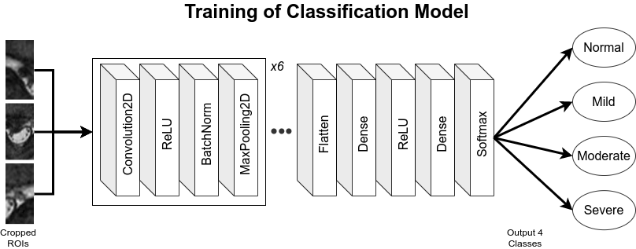

# ROI Classification Model

## Training Setup

Models are implemented with Tensorflow 1.15 and trained on NVIDIA GeForce RTX/GTX GPU devices with CUDA version 9 or 10.

Classification model is developed with Keras sequential class, consisting of a stack of six convolution layers and two fully-connected layers that end with softmax activation for multi-class classification.

## Weighted Categorical Cross-entropy Loss

We use a cost-sensitive loss for training due to the highly imbalanced data distirbution.

See Keras Github for more detailed discussion on the implementation:
https://github.com/keras-team/keras/issues/2115

## References
- Keras official tutorial on image classification models: https://blog.keras.io/building-powerful-image-classification-models-using-very-little-data.html

