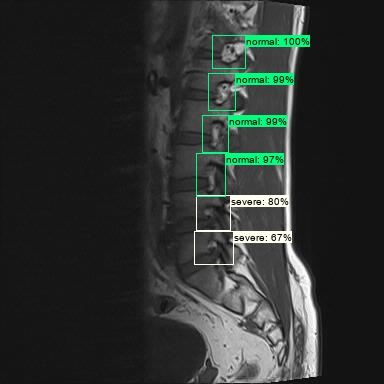

# Inference

First export the inference graph from the object detection step, and use `Object-Detection/object_detection.py` to generate the detection pickle file.

Along with the detection pickle, gather the classifier weights from the classification step, then proceed to generate either XMLs or bounding box overlays:

## Predict and Generate XMLs

The predicted bounding boxes as well as the classifier grades are stored in the form of XML file. To see the annotated labels as predicted, use [LabelImg](https://github.com/tzutalin/labelImg).

`Inference/predict_and_generate_xmls.py` outputs the XML that corresponds to a matching image.

## Predict and Draw Bounding Boxes with Probability

`Inference/predict_and_draw_bounding_boxes_with_prob.py` draws the bounding boxes as overlay on the original image. For machine predictions, it also fetches the probability of the inference confidence level along with the grade.

