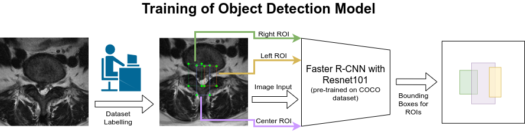

# Object Detection Model based on TensorFlow 1 Detection Model Zoo

## Setup

Detectors are implemented with Tensorflow 1.15 and trained on NVIDIA GeForce RTX/GTX GPU devices with CUDA version 9 or 10.

Object detection model is trained with Tensorflow [Object Detection API](https://github.com/tensorflow/models/blob/master/research/object_detection/g3doc/tf1.md). Faster R-CNN with Resnet101 is selected from the Tensorflow Object Detection [Model Zoo](https://github.com/tensorflow/models/blob/master/research/object_detection/g3doc/tf1_detection_zoo.md). The Faster R-CNN with Resnet101 backbone ([faster_rcnn_resnet101_coco](http://download.tensorflow.org/models/object_detection/faster_rcnn_resnet101_coco_2018_01_28.tar.gz)) is pre-trained on the [COCO dataset](http://cocodataset.org), and is used to initialize our object detector model.

## Configuring Spine ROI Detection Model

Our spinal regions of interest (ROI) detection models are trained with the following customizations:
- graph protos (`*.pbtxt`) for either axial (left, center or right) or sagittal
- config files (`*.config`) to generate the model graphs
  - change the following
    - num_classes
    - batch_size
    - fine_tune_checkpoint
    - train_input_reader path
    - eval_input_reader path

### Train the Object Detection Model and Export Inference Graph

You can follow the guides and tutorials in the "References" below on TF1 object detection. Please make sure you are using a compatible commit of TF1 object detection repo.

We have provided two bash scripts to launch the training and exportation of trained graph:
- init training `obj_det_train_py.sh`
- export inference graph `obj_det_export_inference.sh`

### Inspect Object Detection with Pickle

`Object-Detection/object_detection.py` is used to generate the detection pickle file.

## References
- TF1 Object Detection API https://github.com/tensorflow/models/blob/master/research/object_detection/g3doc/tf1.md
- TF1 Detection Model Zoo https://github.com/tensorflow/models/blob/master/research/object_detection/g3doc/tf1_detection_zoo.md
- TF1 Faster R-CNN with Resnet101 pre-trained on COCO dataset http://download.tensorflow.org/models/object_detection/faster_rcnn_resnet101_coco_2018_01_28.tar.gz
- Tutorial on TF1 object detection: https://pythonprogramming.net/introduction-use-tensorflow-object-detection-api-tutorial/
