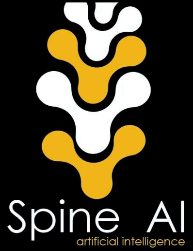

<h1 align="center">
  <p align="center">SpineAI Paper with Code</p>
  
</h1>


## 📄 About

This repository contains **code for our paper published in Radiology Journal (RSNA)**:

> **"Deep Learning Model for Automated Detection and Classification of Central Canal, Lateral Recess, and Neural Foraminal Stenosis at Lumbar Spine MRI"**


[Article link](https://pubs.rsna.org/doi/abs/10.1148/radiol.2021204289) _(Published online: May 11 2021)_

In the paper, we develop and apply AI techniques to automatically detect and classify lumbar spinal stenosis on MRI images.

## 🎓 What’s In This Repo

The setups and implementations of our system are documented in their respective folders:

- [**Object Detection**](Object-Detection/)

Based on Tensorflow object detection API, we pick Faster R-CNN with Resnet101 architecture pre-trained on COCO dataset to detect region of interest (ROI).

- [**Classification**](Classification/)

CNN architecture consisting of six convolutional layers, outputing four-grade classification predictions.

- [**Inference**](Inference/)

Predict relevant spinal regions (ROI) and infer the disease grades, automatic generation of XML outputs and bounding boxes with probability overlays.

- [**Interpretability**](Interpretability/)

Explainable AI technique using Integrated Gradients provided by Tensorflow Core.


## 🤝 Referencing and Citing SpineAI

If you find our work useful in your research and would like to cite our Radiology paper, please use the following citation:

```
@article{hallinan2021deep,
  title={Deep learning model for automated detection and classification of central canal, lateral recess, and neural foraminal stenosis at lumbar spine MRI},
  author={Hallinan, James Thomas Patrick Decourcy and Zhu, Lei and Yang, Kaiyuan and Makmur, Andrew and Algazwi, Diyaa Abdul Rauf and Thian, Yee Liang and Lau, Samuel and Choo, Yun Song and Eide, Sterling Ellis and Yap, Qai Ven and others},
  journal={Radiology},
  pages={204289},
  year={2021},
  publisher={Radiological Society of North America}
}
```

## :mailbox: Contact

Address correspondence to J.T.P.D.H. (e-mail: james_hallinan AT nuhs.edu.sg)

### _Disclaimer_

_This code base is for research purposes and no warranty is provided. We are not responsible for any medical usage of our code._
